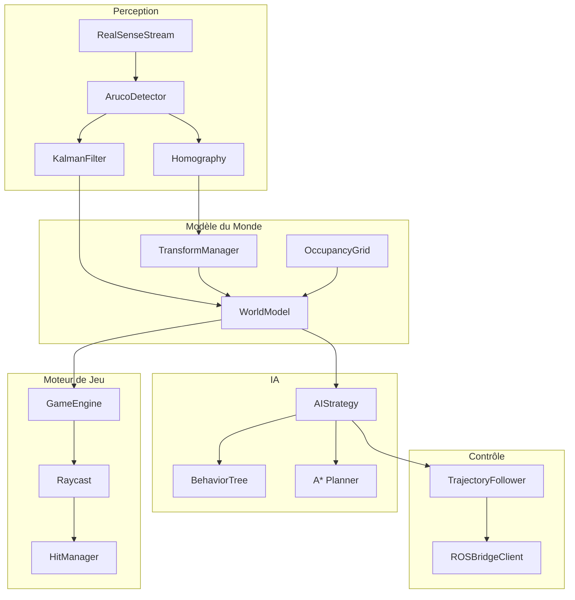
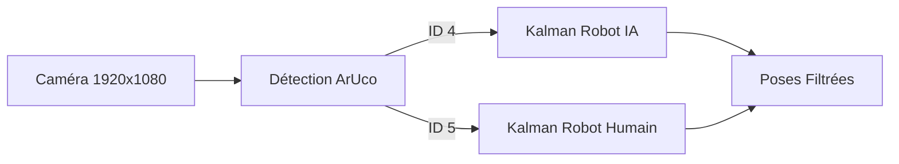
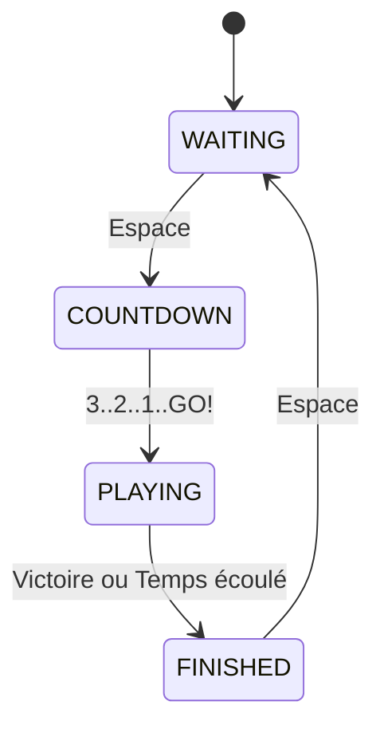
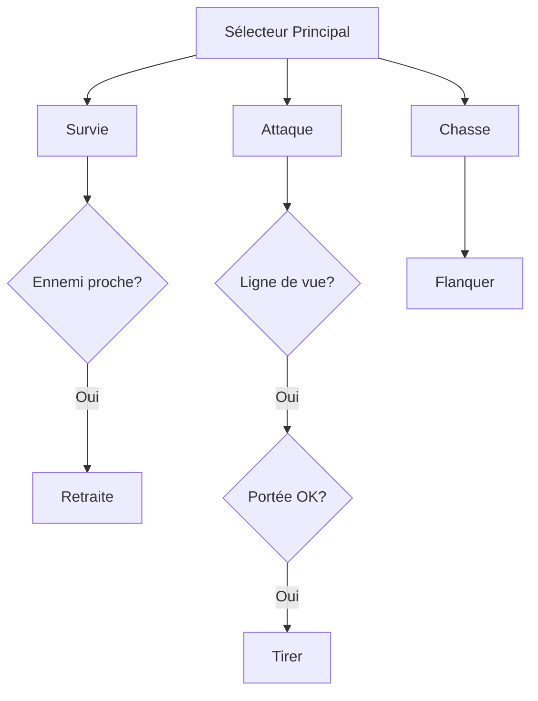
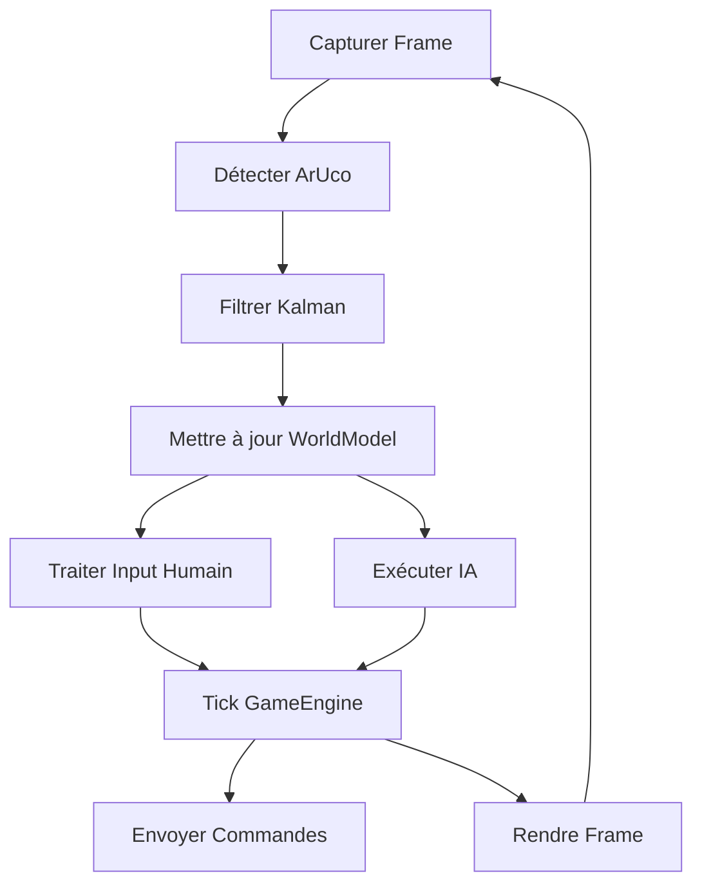

# VA-51 Tank Arena - Documentation Technique

## Introduction

Le projet VA-51 Tank Arena est un système de jeu en réalité augmentée innovant qui oppose deux robots TurtleBot dans un combat stratégique. L'un des robots est contrôlé par une intelligence artificielle sophistiquée basée sur un arbre de comportement, tandis que l'autre est piloté par un joueur humain via une manette PS3 ou un clavier.

Le système repose sur une architecture modulaire qui intègre vision par ordinateur, planification de trajectoire, et projection interactive. Une caméra Intel RealSense capture en temps réel la position des robots grâce à des marqueurs ArUco, tandis qu'un projecteur affiche les éléments de jeu directement sur l'arène physique, créant ainsi une expérience de réalité augmentée immersive.

---

## Architecture Globale

L'architecture du système suit le principe de séparation des responsabilités. Chaque module a un rôle bien défini et communique avec les autres via des interfaces claires.

Le flux de données principal commence par la capture d'images par la caméra RealSense. Ces images sont analysées par le détecteur ArUco qui identifie les marqueurs placés sur chaque robot. Les positions brutes sont ensuite lissées par des filtres de Kalman pour éliminer le bruit de mesure et estimer les vitesses.

Ces données alimentent le WorldModel, qui sert de référentiel central pour l'état du monde. Le moteur de jeu et l'IA consultent ce modèle pour prendre leurs décisions. L'IA génère des commandes de mouvement qui sont transmises aux robots via une connexion WebSocket avec ROS.

---

## Pipeline de Perception

Le pipeline de perception est le premier maillon de la chaîne. Il transforme les images brutes de la caméra en données de position exploitables par le reste du système.

### Acquisition d'Images

La caméra Intel RealSense D435 capture des images en haute définition (1920x1080) à 30 images par seconde. Cette résolution élevée permet une détection précise des marqueurs ArUco même lorsque les robots sont éloignés de la caméra.

### Détection des Marqueurs ArUco

Les marqueurs ArUco sont des codes-barres 2D facilement détectables par vision par ordinateur. Chaque robot porte un marqueur unique : l'ID 4 pour le robot IA et l'ID 5 pour le robot humain. Le détecteur extrait non seulement la position du centre du marqueur, mais aussi les quatre coins, ce qui permet de calculer l'orientation du robot.

### Filtrage de Kalman

Les mesures brutes de position sont bruitées en raison des vibrations, des variations d'éclairage, et des imprécisions de détection. Le filtre de Kalman étendu (EKF) résout ce problème en fusionnant les mesures avec un modèle de mouvement du robot. Le vecteur d'état comprend six variables : position (x, y), vitesse (vx, vy), orientation (θ), et vitesse angulaire (ω).

---

## Modèle du Monde

Le WorldModel est le cœur de la représentation spatiale du système. Il centralise toutes les informations sur l'état de l'arène : positions des robots, obstacles, limites du terrain.

### Grille d'Occupation

L'arène est discrétisée en une grille de cellules de 2cm de côté. Chaque cellule peut être libre (valeur 0) ou occupée par un obstacle (valeur 1). Cette représentation permet une planification de trajectoire efficace via l'algorithme A*.

Pour garantir la sécurité des robots, une zone d'inflation est ajoutée autour de chaque obstacle. Cette marge de sécurité empêche l'IA de planifier des trajectoires trop proches des obstacles, réduisant ainsi le risque de collision.

### Transformations de Coordonnées

Le système manipule plusieurs référentiels de coordonnées : pixels caméra, coordonnées virtuelles de l'arène, et mètres réels. Le TransformManager gère les homographies nécessaires pour convertir les positions entre ces référentiels. Ces transformations sont calibrées lors de la phase d'initialisation du système.

---

## Moteur de Jeu

Le GameEngine est l'arbitre central du match. Il gère les règles du jeu, valide les tirs, et détermine le vainqueur.

### Machine à États

Le match progresse à travers plusieurs états bien définis. Au démarrage, le système est en attente (WAITING). Lorsque le joueur appuie sur Espace, un compte à rebours de 3 secondes commence (COUNTDOWN). Le match démarre ensuite (PLAYING) et se poursuit jusqu'à ce qu'un robot atteigne 10 points ou que le temps imparti (3 minutes) soit écoulé (FINISHED).

### Système de Tir

Chaque robot dispose d'un laser virtuel pour tirer sur son adversaire. L'algorithme Raycast utilise la méthode DDA (Digital Differential Analyzer) pour tracer le rayon du tir à travers la grille d'occupation. Si le rayon atteint l'adversaire sans rencontrer d'obstacle, le tir est validé et un point est attribué.

Les tirs sont soumis à un temps de recharge (cooldown) : 5 secondes pour le joueur humain et 3 secondes pour l'IA, afin d'équilibrer le gameplay.

---

## Intelligence Artificielle

L'IA du robot adversaire repose sur un arbre de comportement (Behavior Tree) qui structure sa prise de décision de manière hiérarchique et modulaire.

### Arbre de Comportement

L'arbre est composé de trois branches principales, évaluées par ordre de priorité :

1. **Survie** : Si l'ennemi est trop proche (< 0.8m), le robot bat en retraite vers une position de couverture.

2. **Attaque** : Si le robot a une ligne de vue dégagée sur l'ennemi et se trouve à portée optimale (1.2m - 3.5m), il vise et tire.

3. **Chasse** : En l'absence des conditions précédentes, le robot cherche une position de flanc pour contourner les obstacles et surprendre l'adversaire.

### Planification de Trajectoire

Pour se déplacer, l'IA utilise l'algorithme A* qui trouve le chemin le plus court en évitant les obstacles. Le chemin brut est ensuite lissé par descente de gradient pour obtenir une trajectoire fluide, puis simplifié par l'algorithme de Douglas-Peucker pour réduire le nombre de waypoints.

---

## Contrôle des Robots

Le module de contrôle traduit les décisions de haut niveau (aller au point X) en commandes de vitesse envoyées aux moteurs des robots.

### Algorithme Pure Pursuit

Le TrajectoryFollower implémente l'algorithme Pure Pursuit pour suivre une liste de waypoints. À chaque instant, il identifie un point cible situé à une distance de "lookahead" devant le robot, puis calcule les vitesses linéaire et angulaire nécessaires pour atteindre ce point.

### Cinématique Différentielle

Les robots TurtleBot utilisent un système de propulsion différentielle avec deux roues indépendantes. La cinématique convertit les commandes (v, ω) en vitesses individuelles pour chaque roue, tout en respectant les limites physiques du robot : 0.22 m/s en vitesse linéaire maximale et 2.84 rad/s en vitesse angulaire.

### Communication ROS

Les commandes sont transmises aux robots via WebSocket, en utilisant le protocole rosbridge. Chaque message contient les vitesses linéaire et angulaire au format JSON, publié sur le topic `/cmd_vel`.

---

## Visualisation

Le rendu graphique utilise Pygame pour afficher l'état du jeu en temps réel, soit sur un écran de contrôle, soit directement sur l'arène via le projecteur.

L'interface comprend un HUD (Heads-Up Display) avec le chronomètre, les scores des deux joueurs, et les barres de cooldown des tirs. Des effets visuels accompagnent les actions : lignes laser pour les tirs, flash jaune pour les hits, et animation de lock-on lorsque l'IA vise sa cible.

En mode debug (touche D), le chemin planifié par l'IA est affiché en vert, permettant de comprendre sa stratégie en temps réel.

---

## Configuration

Le système est entièrement configurable via des fichiers YAML :

| Fichier       | Contenu                                                      |
| ------------- | ------------------------------------------------------------ |
| `arena.yaml`  | Dimensions arène, résolution projecteur, paramètres grille   |
| `camera.yaml` | Configuration RealSense, IDs ArUco, bruit Kalman             |
| `game.yaml`   | Durée match, cooldowns, conditions de victoire               |
| `ia.yaml`     | Seuils IA (distance danger, portée optimale), heuristique A* |
| `robot.yaml`  | Cinématique TurtleBot, limites vitesse, connexion ROS        |

---

## Boucle Principale

Le script `run_game.py` orchestre l'ensemble du système dans une boucle à 30 FPS :

Cette boucle assure la synchronisation de tous les composants et maintient une latence minimale entre la détection des robots et leur contrôle.

---

## Conclusion

Le projet VA-51 Tank Arena démontre l'intégration réussie de technologies avancées : vision par ordinateur, intelligence artificielle comportementale, et robotique mobile. L'architecture modulaire facilite la maintenance et l'extension du système, tandis que la configuration externe permet d'ajuster le gameplay sans modification du code.
