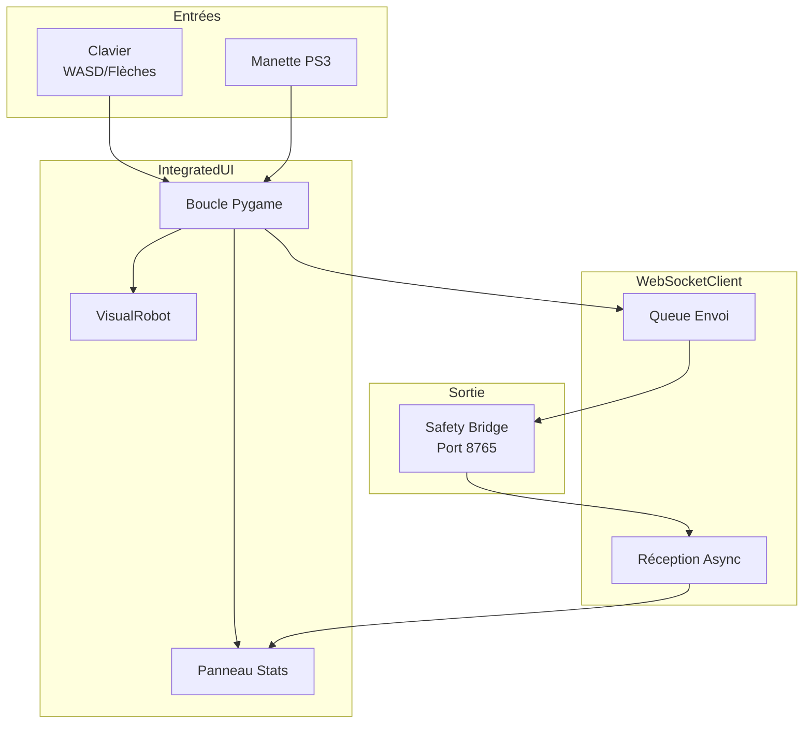
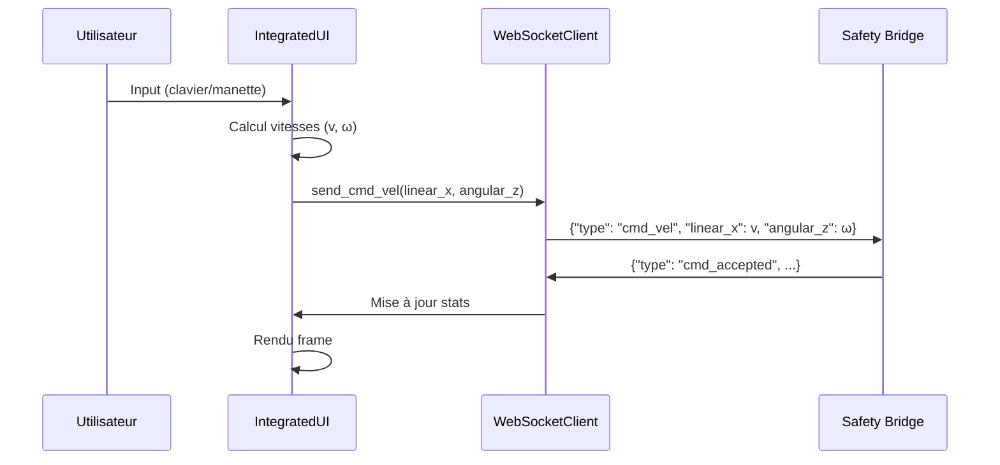

# Control TurtleBot - Documentation

Interface de contrôle manuel pour piloter un robot TurtleBot via WebSocket.

## Architecture



## Flux de Données



## Protocole WebSocket

Le client envoie des messages JSON au Safety Bridge :

| Type             | Description      | Payload                 |
| ---------------- | ---------------- | ----------------------- |
| `cmd_vel`        | Commande vitesse | `linear_x`, `angular_z` |
| `emergency_stop` | Arrêt d'urgence  | -                       |
| `get_status`     | Demande status   | -                       |
| `ping`           | Test connexion   | `timestamp`             |

Réponses du serveur :

| Type           | Description                   |
| -------------- | ----------------------------- |
| `connected`    | Message d'accueil avec config |
| `cmd_accepted` | Confirmation commande         |
| `cmd_rejected` | Commande refusée              |
| `pong`         | Réponse ping                  |

## Configuration

### network.yaml
```yaml
websocket:
  uri: "ws://localhost:8765"
  reconnect_delay_s: 2.0

command:
  frequency_hz: 30
  k_linear: 6.0   # Amplification linéaire
  k_angular: 4.0  # Amplification angulaire
```

### ui.yaml
Paramètres d'interface : dimensions, couleurs, polices.

### controls.yaml
Mapping des touches clavier et boutons manette.

## Structure des Fichiers

```
control_turtlebot/
├── main.py                 # Point d'entrée
├── integrated_ui.py        # Interface Pygame principale
├── websocket_client.py     # Client WebSocket async
├── keyboard_controller.py  # Contrôle clavier
├── ps3_controller.py       # Contrôle manette PS3
├── visual_robot.py         # Représentation visuelle robot
├── config.py              # Constantes et thème
└── config/
    ├── network.yaml       # Configuration réseau
    ├── ui.yaml            # Configuration interface
    ├── controls.yaml      # Mapping contrôles
    └── robot.yaml         # Paramètres robot
```

## Lancement

```bash
cd control_turtlebot
python3 main.py
```

Prérequis : Safety Bridge actif sur `ws://localhost:8765`.
