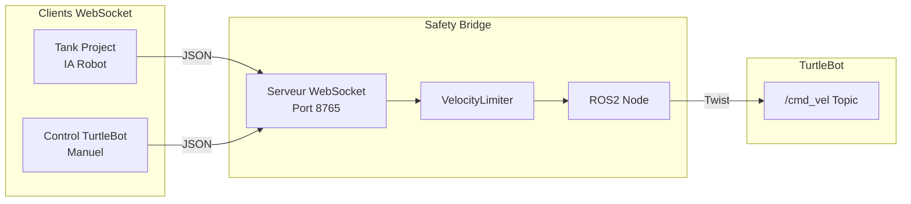
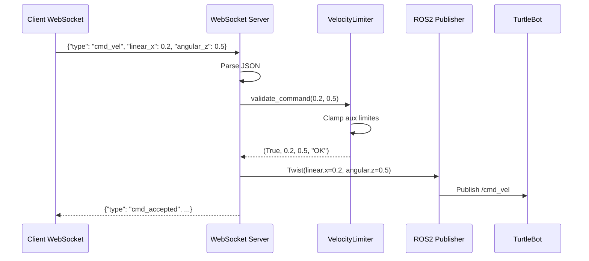
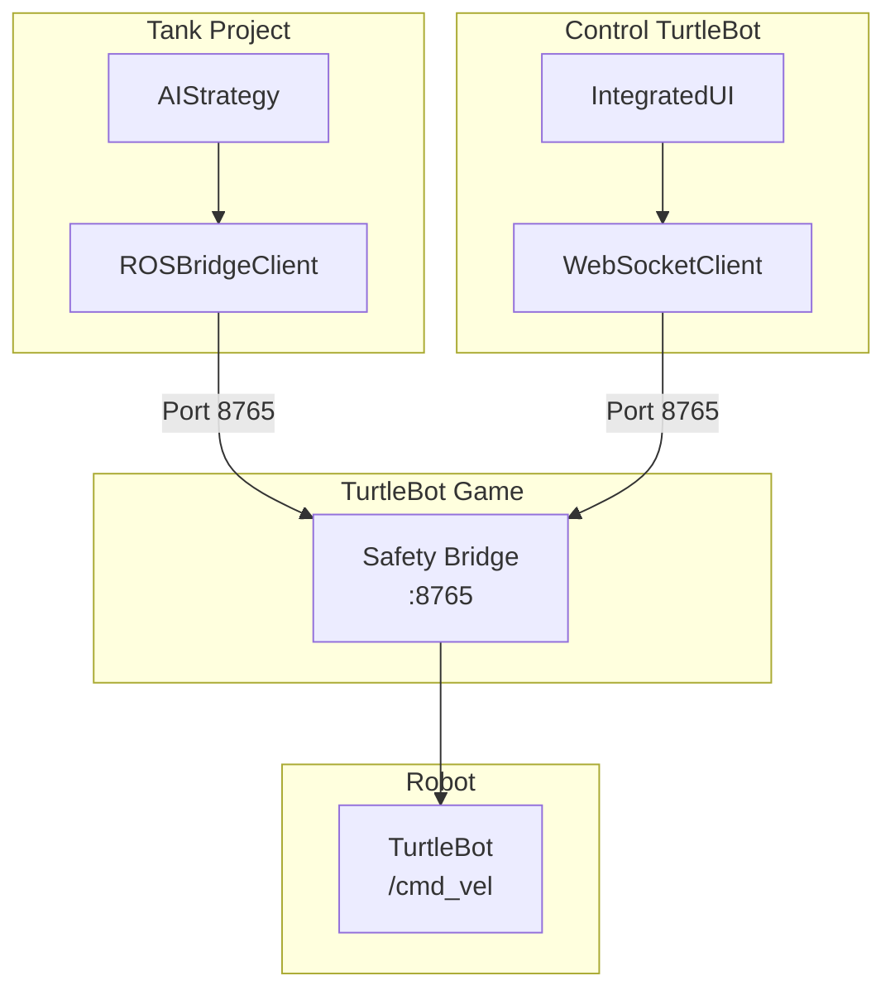

# TurtleBot Game - Documentation

Pont ROS2 entre les clients WebSocket et le robot TurtleBot physique.

## Architecture



## Flux de Traitement



## Protocole WebSocket

### Messages Entrants

| Type             | Description      | Champs Requis           |
| ---------------- | ---------------- | ----------------------- |
| `cmd_vel`        | Commande vitesse | `linear_x`, `angular_z` |
| `emergency_stop` | Arrêt immédiat   | -                       |
| `get_status`     | Demande d'état   | -                       |
| `ping`           | Test connexion   | -                       |

### Messages Sortants

| Type                 | Description              |
| -------------------- | ------------------------ |
| `connected`          | Accueil + config limites |
| `cmd_accepted`       | Vitesses appliquées      |
| `emergency_stop_ack` | Confirmation arrêt       |
| `status`             | État du bridge           |
| `pong`               | Réponse ping             |
| `error`              | Erreur traitement        |

## Limites de Vitesse

Le VelocityLimiter applique des contraintes de sécurité :

| Paramètre         | Valeur Par Défaut |
| ----------------- | ----------------- |
| `max_linear_vel`  | 0.5 m/s           |
| `min_linear_vel`  | -0.3 m/s          |
| `max_angular_vel` | ±1.5 rad/s        |

## Paramètres ROS2

```yaml
robot_namespace: 'robot_controler'
ws_host: '0.0.0.0'
ws_port: 8765
max_linear_vel: 0.5
min_linear_vel: -0.3
max_angular_vel: 1.5
```

## Structure des Fichiers

```
turtlebot_game/
├── package.xml
├── setup.py
├── setup.cfg
├── config/
│   └── bridge_params.yaml
├── launch/
│   └── safety_bridge.launch.py
└── turtlebot_game/
    ├── __init__.py
    └── safety_bridge.py      # Nœud ROS2 principal
```

## Lancement

```bash
# Build le package
cd ~/ros2_ws
colcon build --packages-select turtlebot_game

# Source et lancer
source install/setup.bash
ros2 run turtlebot_game safety_bridge
```

Ou via launch file :
```bash
ros2 launch turtlebot_game safety_bridge.launch.py
```

## Intégration

Le Safety Bridge est le point central de communication :



Les deux clients (Tank Project pour l'IA et Control TurtleBot pour le contrôle manuel) communiquent avec le même Safety Bridge qui publie sur le topic `/cmd_vel`.
